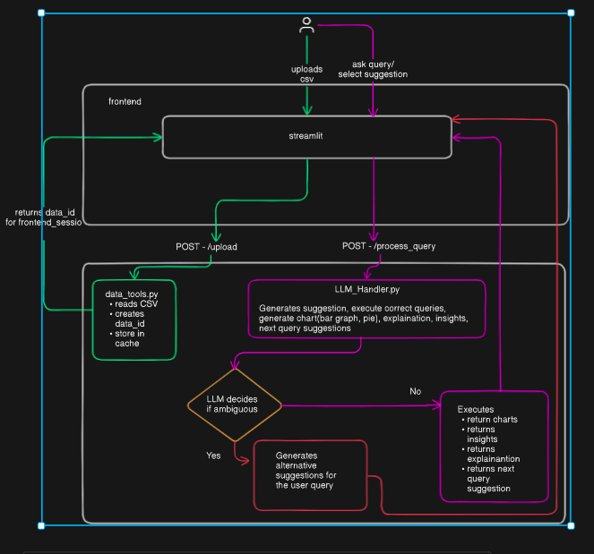
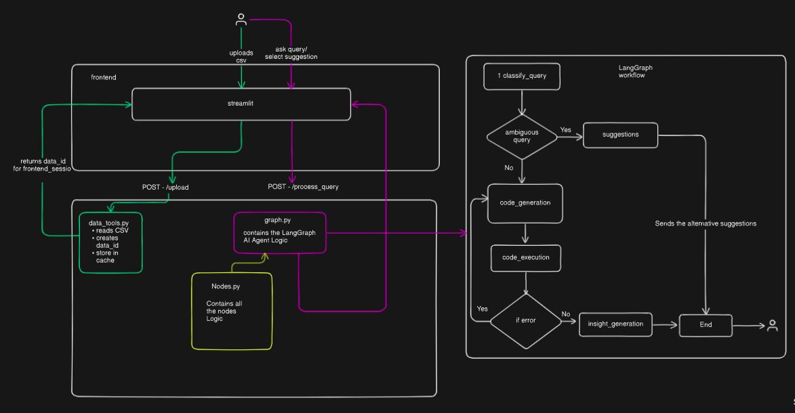

# Finkraft Data Explorer: An AI-Powered Conversational Agent

## 1. Overview

The Finkraft Data Explorer is a Streamlit web application that empowers non-technical users to upload CSV data and conduct complex data analysis using simple, natural language. At its core is a sophisticated AI agent that interprets user queries, generates and executes Python (pandas) code, creates interactive visualizations, and provides proactive insights, transforming the way users interact with their data.

This project evolved from a simple Large Language Model (LLM) implementation into a robust, stateful AI agent built with **LangGraph**, showcasing a powerful paradigm for creating intelligent, conversational applications.

---

## 2. Features

*   **CSV Upload & Automated Profiling:** Instantly upload a CSV and get a comprehensive data profile, including column types, missing values, and statistical summaries.
*   **Natural Language Querying:** Ask questions about your data in plain English (e.g., "*What was the total revenue last quarter?*" or "*Show me the top 5 products by units sold in the North region*").
*   **Automated Chart Generation:** The agent automatically generates interactive **Bar, Pie, Line, and Scatter** charts from the results of your query.
*   **Stateful Conversational Analysis:** Engage in a conversation with your data. Ask follow-up questions that build on previous results.
*   **Proactive Insights & Suggestions:** The agent offers suggestions for ambiguous queries and proactively provides interesting insights based on the results it finds.
*   **Data & Summary Export:** Easily export the final, manipulated dataset to CSV or export a full summary of the analysis session to Markdown.

---

## 3. The Architectural Evolution

This project was developed in two distinct phases, highlighting a critical shift in architectural thinking.

### Phase 1: The Single-Call LLM Framework

The initial version relied on a single, large prompt sent to the Google Gemini model. For every user query, the LLM was asked to perform all tasks at once: understand the query, generate code, create an explanation, and define chart specifications. 

While simple to prototype, this approach had significant limitations:
*   **Brittleness:** One small error in the LLM's multi-part response (e.g., a bug in the generated code) would cause the entire process to fail.
*   **Poor Context Handling:** The model would often get confused by the chat history, leading it to repeat previous answers or fail on complex follow-up questions.
*   **Inability to Recover:** There was no mechanism to handle errors or ask the model to correct its own mistakes.

### Phase 2: The LangGraph AI Agent Framework

To overcome these limitations, the application was re-architected into a true AI agent using **LangGraph**. This transformed the linear, brittle script into a robust, cyclical, and stateful reasoning engine.

The agent is modeled as a **state machine** (a graph) where:
*   **Nodes** are specialized "workers," each with a single responsibility (e.g., `classify_query`, `code_generation`, `code_execution`).
*   **Edges** are conditional routers that direct the flow of information based on the results from each node.

This agentic architecture allows the system to break down complex problems, handle errors gracefully, and maintain a coherent state throughout a long conversation, representing a far more powerful and scalable approach.

---

## 4. Technology Stack

*   **Backend:** Python, FastAPI, LangChain, LangGraph, Google Gemini Pro, Pandas
*   **Frontend:** Streamlit, Plotly
*   **API Server:** Uvicorn

##  Project Architecture
* **LLM Architecture**
 
* **LangGraph AI Agent Workflow Architecture**
 
---

## 5. How It Works: Agent Data Flow

1.  **Upload:** A user uploads a CSV. The backend caches the original, pristine dataset, mapping it to a unique session ID.
2.  **Query:** The user's natural language query is sent to the backend.
3.  **Agent Invocation:** An `AgentState` object is created, containing the user's query and a pointer to the original dataset. This state is the single source of truth for the current task.
4.  **Graph Traversal:** The agent processes the state through its graph:
    *   It first classifies the user's intent.
    *   It then generates Python code to answer the query.
    *   It executes the code against the original data.
    *   Finally, it generates proactive insights from the result.
5.  **History Update:** The final result, including the explanation, charts, and new data view, is logged to the session's chat history.
6.  **Render:** The frontend fetches this updated history and renders the new response, including interactive charts and data tables.

---

## 6. Setup and Running the Application

#### Prerequisites
*   Python 3.11+
*   pip

#### Installation

```bash
# 1. Clone the repository
git clone https://github.com/AdityaPandey4/Finkraft_AI.git

# 2. Navigate to the project directory
cd Finkraft

# 3. Install the required dependencies
pip install -r requirements.txt
```

#### Configuration

1.  Create a file named `.env` in the root of the project directory.
2.  Add your Google Gemini API key to the file:

```
GOOGLE_API_KEY="your_api_key_here"
```

#### Running the Application

The Streamlit frontend acts as the controller for the backend server.

1.  **Start the Streamlit UI:**
    ```bash
    streamlit run frontend/app.py
    ```
2.  **Start the Backend Server:**
    *   Open the application in your browser.
    *   In the sidebar, select the **"LangGraph Version"** from the dropdown.
    *   Click the **"Start Server"** button. This will launch the Uvicorn backend process.

3.  **Begin Analysis:** You can now upload a CSV file and start your conversation.

---

## 7. Key Challenges & Solutions

The move to an agentic framework was driven by the need to solve several core problems:

*   **Challenge: Context Confusion**
    *   **Problem:** The agent would get confused by past interactions and repeat old answers.
    *   **Solution:** We engineered the prompts to create a clear separation between the "previous conversation" and the "current query." By passing a clean, summarized history string, we enabled the LLM to use context effectively without getting distracted.

*   **Challenge: Destructive Data Operations**
    *   **Problem:** Performing an aggregation (like `GROUP BY`) would overwrite the original dataset, making it impossible to answer follow-up questions requiring the original level of detail.
    *   **Solution:** We modified the data flow to ensure the agent **always** runs its code against the original, cached dataset. This non-destructive approach preserves the source of truth and allows for deep, multi-turn analysis.

*   **Challenge: Unhelpful Suggestions**
    *   **Problem:** For vague queries, the agent would provide overly technical (e.g., SQL) or irrelevant suggestions.
    *   **Solution:** We enhanced the `suggestion` node by providing it with the full schema of the user's data and explicitly instructing it to generate user-friendly, natural language queries. This turned a weak feature into a powerful guidance mechanism.